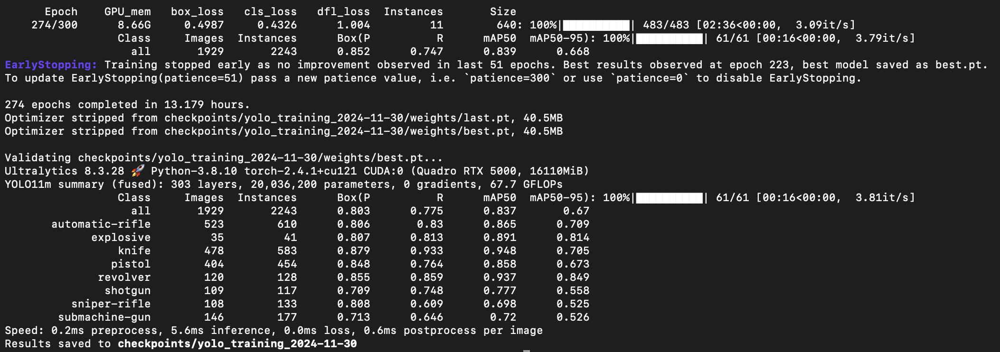

## High-Level Testing Document: YOLO Weapon Detection in Rakshak Project

### Introduction

This document outlines the high-level testing plan for the weapon detection system implemented using the `YOLO (You Only Look Once)` model in the Rakshak project. The purpose of this testing is to validate the Proof of Concept (PoC) and ensure that the YOLO model is functioning correctly for weapon detection in video inputs. Given that this is an early-stage implementation, the focus is on validating the basic functionality and performance of the model, rather than comprehensive testing.

### Objective

The main goal of testing at this stage is to verify that the YOLO model can reliably detect weapons in video frames. This will help assess the feasibility of the approach and guide future steps in the project, such as improving model accuracy and performance and integrating the detection system into the complete Rakshak solution.

### Testing Methodology

The following approach was used to conduct testing on the YOLO weapon detection model:

1. **Test Cases**:
   - **Test Case 1**: Detecting a weapon in a clear, high-resolution video.
   - **Test Case 2**: Detecting a weapon in a low-resolution or blurry video.
   - **Test Case 3**: Identifying a weapon in a frame with multiple objects, including non-weapon items.
    - **Test Case 4**: Verifying detection accuracy across different weapon types (e.g., guns, rifles).
    - **Test Case 5**: Assessing the model's response to environmental changes, such as lighting variations.

2. **Test Environment**: 
   - **Video Source**: The test cases were executed using both pre-recorded video files and live webcam feeds to simulate real-world surveillance scenarios.
   - **Model**: The [YOLOv11](https://github.com/ultralytics/ultralytics) model was used, which was pre-trained on general object detection data and fine-tuned for weapon detection.
  
### Test Results

1. **Test Case 1: High-Resolution Video**
   - **Result**: The model successfully detected weapons in clear, high-resolution videos with a high degree of accuracy.
   - **Findings**: The bounding box was correctly placed around the weapon, and the model confidently identified the object as a weapon.
  
2. **Test Case 2: Low-Resolution/Blurry Video**
   - **Result**: The model detected weapons, but the accuracy decreased with low-resolution or blurry videos.
   - **Findings**: In some instances, the weapon was missed, or the bounding box was not correctly placed.
  
3. **Test Case 3: Multiple Objects in the Frame**
   - **Result**: The model was able to detect weapons even when multiple objects were present in the frame.
   - **Findings**: However, there were instances of false positives where non-weapon objects (e.g., tools, tables) were incorrectly classified as weapons.
  
4. **Test Case 4: Multiple Weapon Types**
   - **Result**: The model correctly identified different types of weapons (e.g., guns, rifles).
   - **Findings**: The weapon type was mostly detected, but further adjustments are needed to differentiate between objects that may appear similar.
  
5. **Test Case 5: Environmental Changes (Lighting, Angles)**
   - **Result**: The model performed decently under varying lighting conditions, especially in low-light environments.
   - **Findings**:  In bright or backlit conditions, the model's accuracy was somewhat reduced, leading to some false negatives.
  
### Model Training Metrics

The image below shows the key performance metrics from one of the training processes of the YOLO model, including precision, recall, mAP50, and mAP50-95.

### Issues Identified

- **False Positives**: The model occasionally misidentified non-weapon objects, like tools or bags, as weapons, especially in cluttered scenes.
- **False Negatives**: Weapons were sometimes missed, particularly in blurry or low-resolution frames.
- **Detection in Varying Conditions**: Performance slightly dropped in poor lighting or when weapons were partially obscured.

### Next Steps

- **Model Improvement**: The model needs fine-tuning with a more diverse weapon detection dataset and additional training on various scenarios, including different camera angles and lighting, to improve accuracy and robustness.

- **Integration**: After improvements, the model will be integrated into the Rakshak system.

- **Real-World Testing**: After integration, we will conduct further real-world testing to evaluate the model's performance in a real environment, considering factors like camera positioning and network latency.

### Conclusion

The testing of the `YOLO` weapon detection model has demonstrated its potential for real-time weapon detection in video feeds. While the model performed well under ideal conditions, there are areas for improvement, particularly in handling false positives, false negatives, and challenging environmental factors. From the initial testing and proof of concept, the project seems feasible and shows promise for further development.