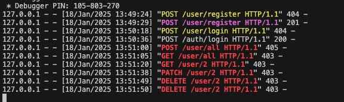
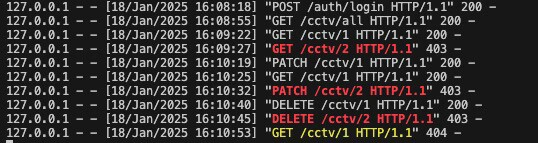

# Security Testing Report – Rakshak

## 1. Purpose
The purpose of this security testing is to ensure that Rakshak properly protects sensitive routes, enforces role-based access control, and does not expose critical data to unauthorized users.

---

## 2. Scope

- Session and authentication validation
- Role-based access enforcement
- Protection of admin-only routes
- API endpoint restrictions
- Session storage handling
- Unauthorized action prevention

---

## 3. Testing Environment

| Component      | Configuration                        |
|----------------|--------------------------------------|
| Frontend       | Next.js (Session stored in cookies)  |
| Backend        | Flask with Flask-Login (Server-side sessions) |
| Deployment     | Local Dockerized environment         |
| Roles Tested   | Normal User, Site Admin              |
| Tools Used     | Browser DevTools, Incognito Mode, Postman, Direct API Requests |

---

## 4. Test Scenarios and Results

| Test ID | Scenario                                              | Expected Outcome                                         | Result     | Comments                                                      |
|--------:|-------------------------------------------------------|----------------------------------------------------------|------------|---------------------------------------------------------------|
| 1       | Access admin routes without login                     | Redirect to login page                                   | Success    |                                                               |
| 2       | Access admin routes as a normal user                  | Access is denied or redirected                           | Success    |                                                               |
| 3       | Direct API request to /manage-users without session   | HTTP 401 Unauthorized or redirect                        | Success    |                                                               |
| 4       | Modify user role from frontend as normal user         | Action is blocked by backend                             | Success    |                                                               |
| 5       | Session stored on browser side                        | Only session ID is visible; no personal data exposed     | Success    |                                                               |
| 6       | Token tampering or session ID change                  | Invalid session is rejected                              | Success    |                                                               |
| 7       | Submit form with malicious input (XSS or SQL)         | Input is sanitized or blocked                            | Partial    | Some form inputs lack sanitization; will improve in future    |

---

## 5. Observations

- Server-side sessions using **Flask-Login** are securely implemented.
- Critical routes like **Manage Users** and **Manage CCTV** are properly protected and role-restricted.
- No personal information is exposed in the browser — only a session ID is stored.
- **Form sanitization** is not fully implemented, posing a minor XSS risk if used maliciously.
- Unauthorized access attempts (via URL or API) are correctly rejected.

## 5.1 Additional Security Practices

- All user passwords are hashed using **flask_bcrypt** before being stored in the PostgreSQL database.
- The hashing is done server-side using Flask utilities to ensure security and prevent plaintext storage.

---

## 6. Security Testing Evidence

This section includes sample evidence from our testing sessions, showing real-time validation of route protections, access control, and session-based authorization handling.

  
**Figure 1: Role-based access denial for normal user**  
This log shows a normal user attempting to access admin routes like `PATCH`, `DELETE`, and `GET /user`. Each attempt is correctly rejected with a `403 Forbidden`, confirming that role-based restrictions are enforced.

 
 

  
**Figure 2: Site Admin CCTV access and error handling**  
This log shows a Site Admin successfully retrieving all CCTV feeds and specific feed `/cctv/1`, but receiving `403` or `404` responses for `/cctv/2`, which didn’t exist. This confirms proper route protection and error handling for invalid or unauthorized resource access.

 

---

## 7. Conclusion

Rakshak enforces role-based access control effectively and secures all admin-level routes. Session handling is implemented using server-side storage, reducing client-side risk. One area for improvement is stronger **input validation** and **XSS protection** on form fields.  
We plan to integrate stricter sanitization logic and possibly use a Web Application Firewall (WAF) in future deployments.

