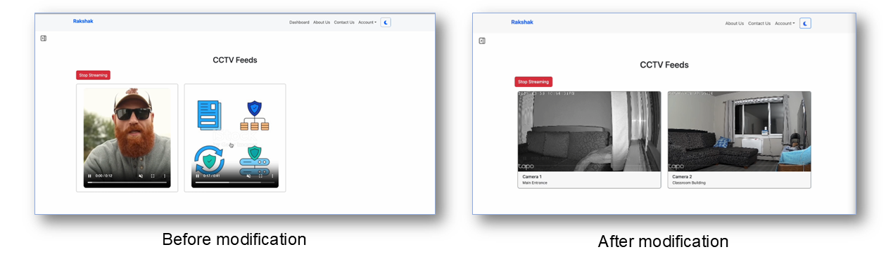
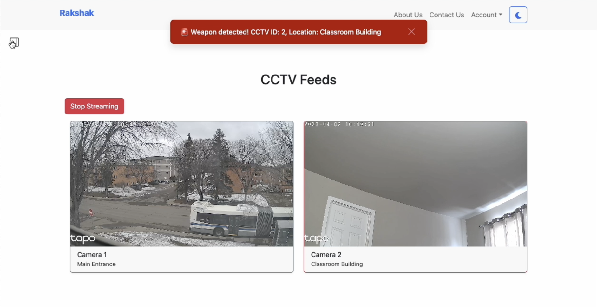

# User Testing Report for Rakshak

## Introduction

This report documents the user testing conducted for **Rakshak**, our real-time weapon detection surveillance system. Testing was performed in multiple phases to gather meaningful feedback from real users and improve overall usability.

- Initial testing took place during **Bazaar Day**, where fellow students and classmates interacted with the live system.
- Professors **Dr. Kin-Choong Yow** and **Dr. Timothy Maciag** also provided insightful feedback during the Bazaar Day showcase.
- Additional user testing was performed at **UofR Housing**, where **Tirth** (one of our team members) works. A fellow colleague was invited to try the complete system.
- Our **two roommates** also tested Rakshak and shared helpful feedback regarding alert visibility and notification design.

---

## Objective

- Collect user feedback to improve Rakshak's design and functionality  
- Identify usability issues or gaps in the experience  
- Understand user expectations and needs in real-world scenarios  

---

## Tasks

- Interact with the Rakshak system, including live CCTV, alerts, and admin features  
- Explore functionality as a normal user and provide feedback on usability and clarity  
- Evaluate alert response and visual feedback from the system  

---

## Findings

### Login and Registration Page  
**Feedback:** Clean, simple, and easy to understand.  
**Update:** No changes needed.

---

### CCTV Feeds Page  
**Feedback from users and professors:**  
- The aspect ratio and initial layout made the feeds harder to view clearly.  
- **Professor Timothy Maciag** suggested improving the feed layout for better UI experience and viewability.

**Update:**  
We modified the feed interface to adopt a **16:9 aspect ratio**, enhancing visual clarity.  
 

 

**Figure 1:** Updated CCTV feed layout with 16:9 aspect ratio

---

### Alert Trigger & Current Alert Page  
**Feedback:**  
- Users liked the display of the **captured image and alert metadata**.  
- Some experienced a **noticeable delay of about 5 seconds** between the weapon appearing on screen and the detection alert being shown.  
- The **timestamp display** was confusing, and users suggested using a simplified format like **YYYY-MM-DD and HH:MM:SS** for better clarity and understanding.  
- Our **roommates** suggested adding **in-app notifications or banners** so that users are immediately alerted when a weapon is detected — even if they are on another page or not actively monitoring the app.

**Update:**  
- Latency is hardware-related and will require **high computational power and dedicated GPU servers**, which can be addressed during production deployment.  
- Timestamp formatting and local time display improvements are noted but are not a critical priority at this stage.  
- **In-app notifications** have been added to our future feature roadmap to ensure users are alerted even when they are not actively monitoring the app (see **Figure 2** below).  

  
 

**Figure 2:** Proposed in-app notification banner for instant weapon detection alerts

---

### User and CCTV Management Pages  
**Feedback:**  
- Well-structured and contains all required admin features.  
**Update:** No changes required.

---

### Email Notification Functionality  
**Feedback:**  
- Helpful for remote alerts, especially if the app isn’t active.  
- **Professor Dr. Kin-Choong Yow** recommended adding **text-based push notifications** instead of email, if possible within our timeline.  
- Users noted that **text alerts** are more likely to be noticed quickly.

**Update:**  
- SMS/text-based notifications are planned for a future release.  
- Current email alert system was validated and performs as expected.

---

## Summary

Rakshak underwent thorough user testing during **Bazaar Day**, at **UofR Housing**, and in casual settings with roommates and peers. Valuable feedback led to meaningful updates such as improving the **CCTV feed layout** and planning enhancements like **text notifications** and **in-app banners**.

Overall, users found Rakshak intuitive and functional. These sessions helped us better understand real user needs, sharpen our UI, and prioritize future development efforts.
